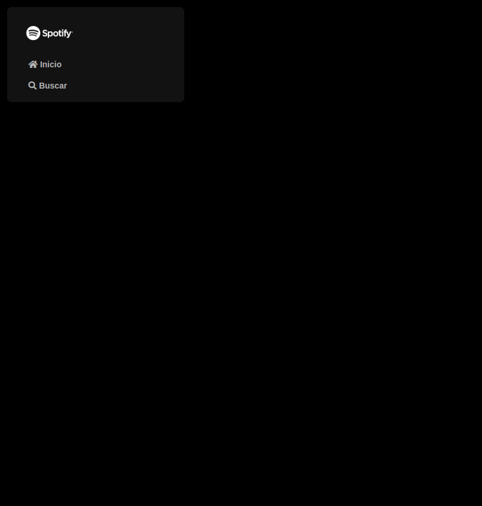
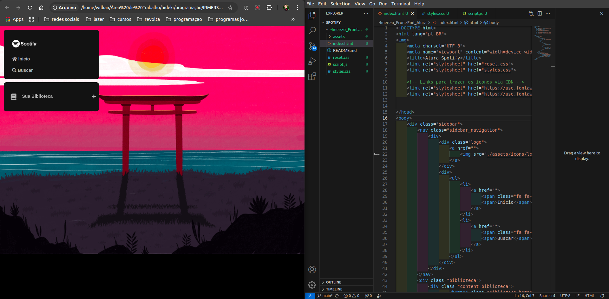
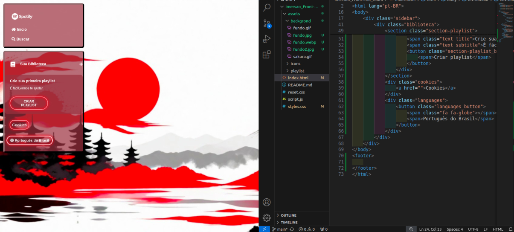
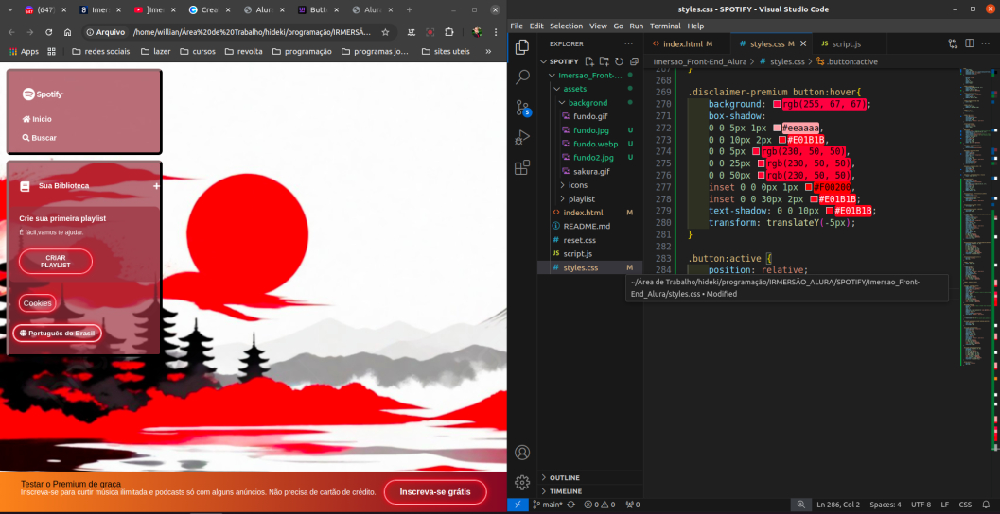
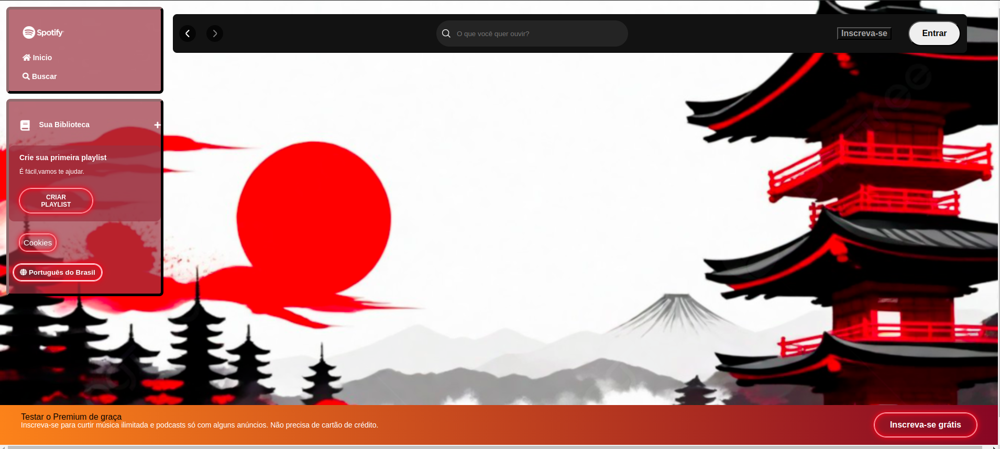
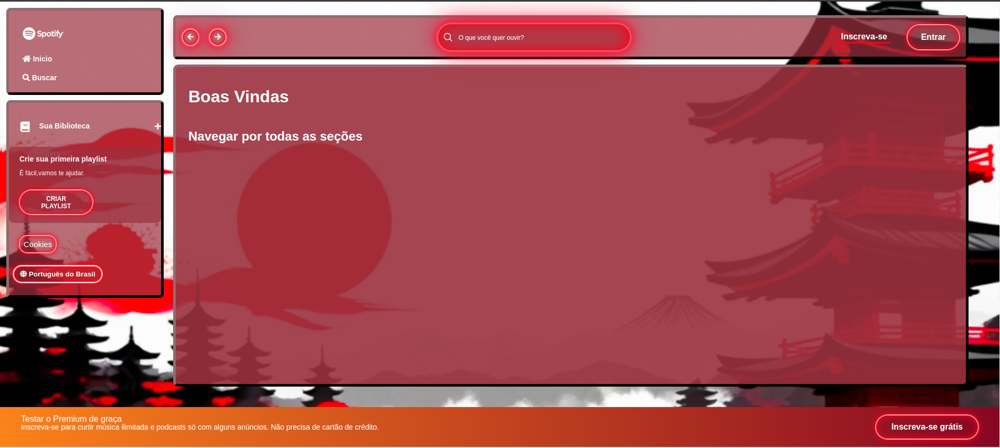
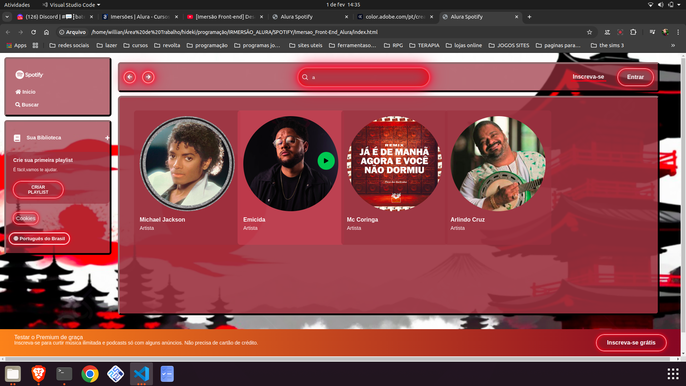
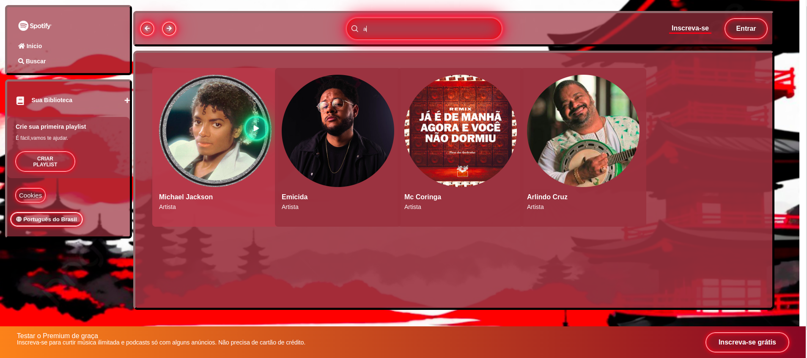
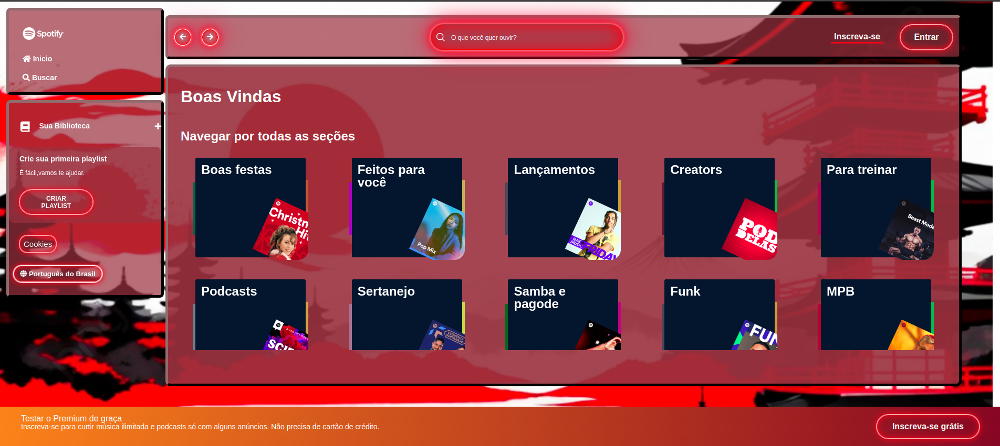

# -Imers-o_Front-End_Alura 🤿👨‍💻
Durante a Imersão Front-end da Alura, o projeto tem como base em HTML e CSS e utiliza frameworks como Angular e React e desenvolver um projeto prático .

# Projeto com estrutura React

## AULA 1
📖Conteúdo:
- Entrar no VSCode;
- Compreender as diferenças entre HTML, CSS e JavaScript;
- Fazer a sidebar navigation;
- Aprender dicas de atalho no VSCode para escrever HTML;
- Introduzir as propriedades de estilo do CSS no projeto, com truques no Devtools;
- Desafio: construir a aba “Sua biblioteca”.

Fizalização da aula 1:

Finalização do desafio da aula 1:

## AULA 2
📖Conteúdo:
- Criar todo menu lateral da página;
- Aprender os fundamentos do CSS Flexbox;
- Saber mais sobre posicionamentos no CSS;
- Desafio: Fazer a tag <footer> (brinque com o botão, faça o gradiente, etc).

Fizalização da aula 2:

Finalização do desafio da aula 2:

## AULA 3
📖Conteúdo:
- Estruturar melhor o projeto;
- Refatorar o código;
- Fazer o layout flexbox;
- Aprender conceitos de responsividade;
- Criar o menu superior;
- Desafio: Fazer os cards de “Boa tarde” e “Navegar por todas as seções”.

Finalização da aula 3:

Finalização do desafio da aula 3:

## Aula 4
📖Conteúdo:
- Criar os cards da página inicial;
- Aprender a usar o CSS Grid Layout;
- Utilizar media queries para responsividade;
- Instalar do Node.js;
- Introduzir o JavaScript no projeto;
- Utilizar o conceito DOM;
- Conhecer o método Promises do JavaScript;
- Desafios: fazer mais cards se baseando na página do Spotify e criar um arquivo API JSON diferente.

Fizalização da aula 4:

Fizalização do desafio da aula 4:

## Aula 5
📖Conteúdo:
- Criar os cards da página inicial;
- Aprender a usar o CSS Grid Layout;
- Utilizar media queries para responsividade;
- Instalar do Node.js;
- Introduzir o JavaScript no projeto;
- Utilizar o conceito DOM;
- Conhecer o método Promises do JavaScript;
- Desafios: fazer mais cards se baseando na página do Spotify e criar um arquivo API JSON diferente.

Finalização da aula 5:

Gif mostrando as funcionalidades da tela:
 
